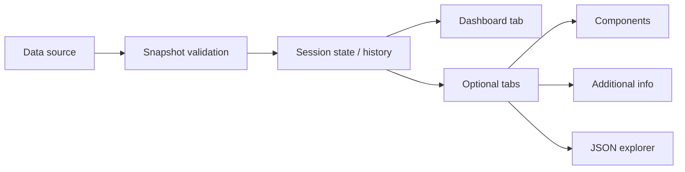

# Energy Monitoring Dashboard

> Streamlit dashboard for live energy and media monitoring with a built-in local demo backend.

This project provides a compact monitoring interface for machine-level energy data. It is designed for quick local startup, clear visual feedback, and easy adaptation when individual dashboard areas are not needed.

## Overview

| Area | Description |
| --- | --- |
| Live monitoring | Displays current machine and component values from a continuously updated snapshot stream. |
| Fast local setup | Starts as a normal Streamlit app and works well for demos or local development. |
| Modular UI | Additional tabs are intentionally separated, so the interface can be simplified without deep code changes. |
| Visualization-first | Focus on readable status indicators, time-series views, and structured machine data inspection. |

## Quick Start

```bash
pip install -r requirements.txt
streamlit run app.py
```

After startup, the dashboard opens in the browser and connects to the configured data source automatically. In the default setup, the local demo backend is used so the application can be explored immediately.

## What You Get

- A main dashboard for live energy and machine state monitoring
- Optional views for components, additional information, and JSON inspection
- A local mock backend for development and demonstrations
- Shared plotting, validation, and transformation helpers for a consistent UI

## Application Flow



## Interface Structure

The dashboard is built around one central monitoring view plus optional extensions:

| View | Purpose |
| --- | --- |
| `Dashboard` | Main operational overview with the most important live values and status information |
| `Components` | Focused breakdown of component-level values |
| `Additional Info` | Supplemental machine context and supporting details |
| `JSON Explorer` | Raw structured snapshot inspection for debugging and validation |

## Customization

The application is intentionally friendly for lightweight adaptation.

### Remove Unneeded Tabs

If a view should not appear, delete its corresponding optional file:

- `tab_components_optional.py`
- `tab_additional_info_optional.py`
- `tab_json_explorer_optional.py`

Missing optional files are handled gracefully. The remaining tabs continue to load without breaking the application.

### Use an External Data Source

If the dashboard should connect to an existing backend instead of the local demo service, start it with:

```bash
DATA_SERVER_URL=https://example.com streamlit run app.py
```

## Project Layout

| File | Role |
| --- | --- |
| `app.py` | Main Streamlit entrypoint |
| `dashboard_app.py` | Application bootstrap and runtime orchestration |
| `dashboard_views.py` | Core dashboard rendering |
| `dashboard_tabs.py` | Tab registry and optional tab loading |
| `live_data.py` | Live data ingestion and history handling |
| `data_server.py` | Local demo backend |
| `plotting.py` | Shared Plotly figure creation |
| `snapshot_schema.py` | Snapshot validation helpers |
| `utils.py` | Shared utility helpers |

## Design Goals

- Clear operational overview instead of overly technical clutter
- Easy local demonstration without extra infrastructure
- Low-friction customization for non-developers
- Robust behavior when optional UI modules are removed

## Notes

Additional implementation details and technical structure are documented in [`struktur.md`](./struktur.md).
